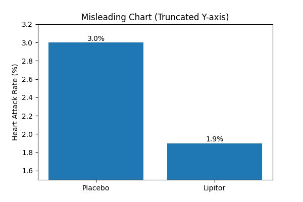
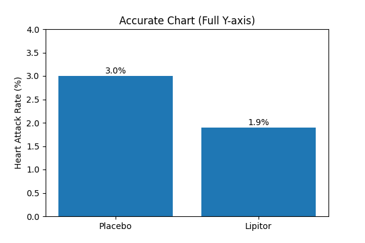

# 같은 데이터, 다른 메시지  
## 제약회사 광고 사례로 보는 시각화와 통계 표현의 함정

같은 데이터라도 표현 방식에 따라 전혀 다른 의미로 받아들여질 수 있다.  
본 글에서는 실제 사례를 통해 차트 선택과 통계 표현 방식이 어떤 오해를 낳는지 살펴본다.

---

## 1. 문제 상황

뉴스 기사에서는 고지혈증약이 심장발작 위험을 36% 감소시킨다고 강조하고 있었다.

하지만 실제 데이터를 보면 다음과 같다.

- 위약군: 3.0%
- 약 복용군: 1.9%

즉, 실제 차이는 1.1%p 감소에 불과하다.

---

## 2. 통계 표현 방식의 차이

같은 데이터를 표현하는 방식에는 두 가지가 있다.

### 2.1 절대위험감소 (Absolute Risk Reduction)

- 3.0% → 1.9%
- 1.1% 감소

이 방식은 실제 효과 크기를 그대로 보여준다.

---

### 2.2 상대위험감소 (Relative Risk Reduction)

- (3.0 - 1.9) / 3.0 × 100
- 36% 감소

이 방식은 효과가 더 크게 보이도록 만든다.

---

## 3. 인식의 차이

같은 데이터라도 다음과 같이 다르게 받아들여질 수 있다.

- 1.1% 감소 → 효과가 크지 않다고 인식
- 36% 감소 → 효과가 크다고 인식

즉, 표현 방식이 사람의 판단에 직접적인 영향을 준다.

---

## 4. 차트 선택에 따른 왜곡

데이터를 시각화할 때 축을 어떻게 설정하느냐에 따라 차이가 크게 보일 수 있다.

### 4.1 왜곡된 그래프

Y축을 일부 구간만 사용하여 차이를 과장한 사례이다.  
실제보다 효과가 크게 보일 수 있다.

---

### 4.2 올바른 그래프

Y축을 0부터 시작하여 실제 데이터를 그대로 보여준다.  
효과의 크기를 보다 정확하게 판단할 수 있다.

---

## 5. 결론

데이터 자체는 동일하지만, 표현 방식에 따라 전혀 다른 메시지가 전달될 수 있다.  

특히 상대위험과 절대위험의 차이, 그리고 차트 축 설정은  
데이터 해석에 큰 영향을 미친다.

따라서 데이터를 해석할 때는 수치뿐 아니라  
표현 방식까지 함께 고려해야 한다.
